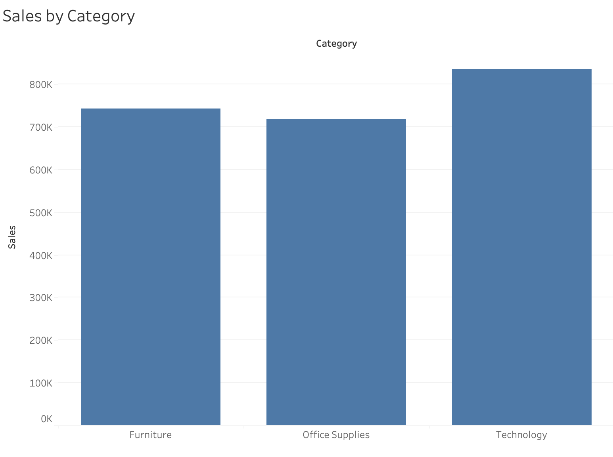
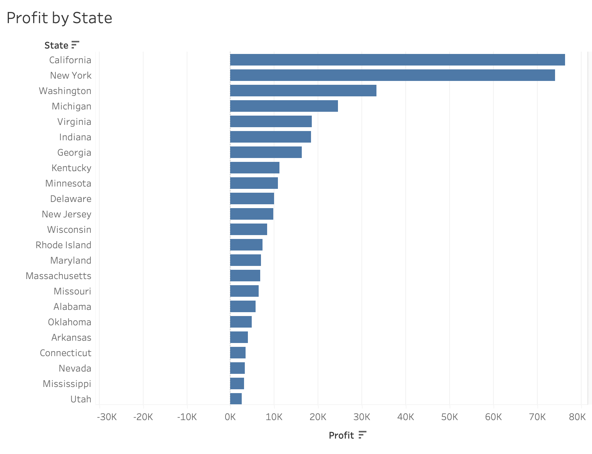
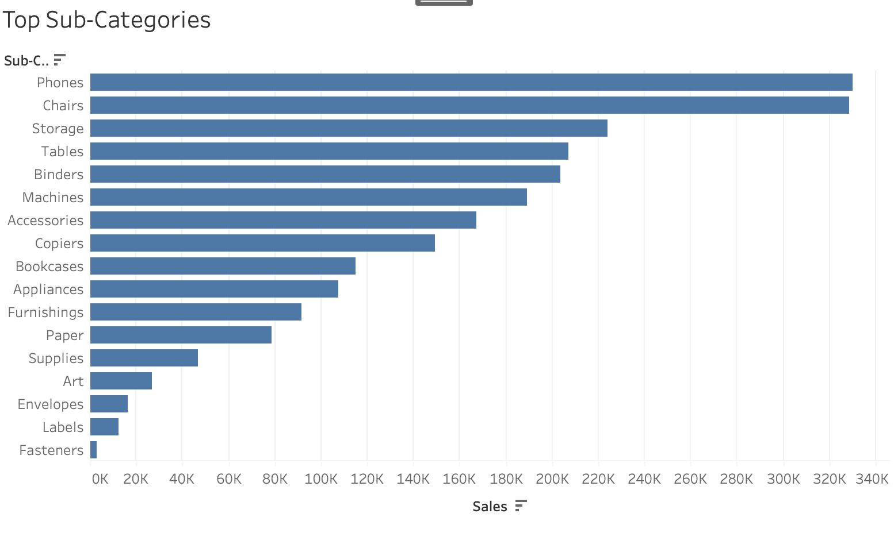

# Retail Sales Performance Dashboard

Analyzed retail sales data using PostgreSQL, SQL, and Tableau to identify revenue trends, profitable product categories, and regional business performance insights.

## Overview

This project combines SQL analysis and Tableau visualization using the Superstore dataset to evaluate retail business performance and generate actionable insights.

## Tools Used

* PostgreSQL
* SQL
* Tableau Public

## Analysis Performed

* Total sales and profit analysis
* Sales by category
* Profit by state
* Top-selling sub-categories
* Identification of loss-making states

## Key Insights

* Total sales exceeded $2.29 million.
* Total profit exceeded $286,000.
* Phones generated the highest sales among sub-categories.
* Technology products were among the strongest business performers.
* Some states generated negative profit despite strong sales.

## 📁 Project Structure

```text
retail-sales-performance-dashboard/
│
├── data/
│   └── SampleSuperstore.csv
│
├── sql/
│   └── retail_sales_queries.sql
│
├── tableau/
│   ├── sales_by_category.png
│   ├── profit_by_state.png
│   └── top_subcategories.png
│
├── results/
│   └── key_insights.md
│
├── README.md
└── requirements.txt
```

## Tableau Visualizations

The `tableau/` folder contains visualizations created using Tableau Public:

* Sales by Category
* Profit by State
* Top Sub-Categories

## Dataset Source

- Sample Superstore Dataset
- Commonly used retail analytics dataset for SQL and Tableau projects

## Visualization Previews

### Sales by Category


### Profit by State


### Top Sub-Categories


## Resume Description

Analyzed retail sales data using PostgreSQL and SQL to identify revenue trends, profitable product categories, and regional business performance. Built Tableau visualizations to communicate key business insights.
